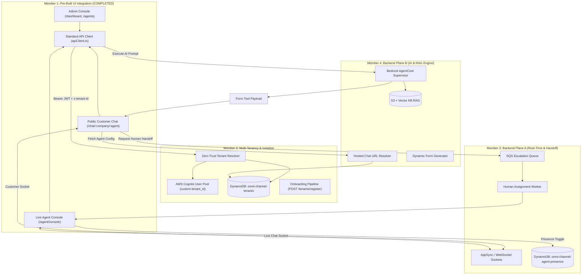

# Multi-Tenant AI Platform — 4-Member Rapid Execution Guide (Finish by Tomorrow)

> [!IMPORTANT]
> **CRITICAL DEADLINE & CONTEXT**:
> 1. **Deadline**: **Finish by tomorrow**. All tasks must be executed concurrently in high-priority, parallel blocks.
> 2. **UI Status**: **The frontend applications are already built in a separate repository**. Member 1 does **NOT** build the UI from scratch—their job is **UI Integration**: connecting the pre-built frontends to this backend, wiring Cognito authentication, configuring environment endpoints, and hooking up the real-time WebSocket/AppSync streams.

---

## 1. Team Role Allocation & Architecture Matrix

| Member | Focus Area | Key Responsibilities & Module Ownership | Deliverables & Artifacts | Status |
| :--- | :--- | :--- | :--- | :---: |
| **Member 1** | **UI Integration & Frontend Wiring** | • Connect Admin Console, Live Agent Console & Public Chat to Backend APIs<br>• Standardized API Client (`apiClient.ts`) with JWT & Tenant Header injection<br>• Cognito Auth SDK, Presence Switcher, Dynamic Forms & Human Escalation | `omni-agent-ui-main`<br>`src/api/apiClient.ts`<br>`src/pages/agent/LiveAgentConsole.tsx`<br>`src/pages/public/HostedChatWidget.tsx` | ✅ **COMPLETED** |
| **Member 2** | **Multi-Tenancy & Company Onboarding** | • Cognito Multi-Tenant Auth (`custom:tenant_id` claims)<br>• Zero-Trust Tenant Resolver & Header Spoofing Guard (`403 TENANT_MISMATCH`) <br>• DynamoDB Tenant Partitioning (`omni-channel-tenants`, `omni-channel-agents`)<br>• AWS Step Functions / Lambda Company Onboarding Pipeline (`POST /tenants/register`) | `infra/cognito/`<br>`services/tenant-resolver/`<br>`scripts/create-tenants-table.ts`<br>`services/tenant-router/` | ⏳ **IN PROGRESS** |
| **Member 3** | **Backend Plane A: Real-Time Chat & Handoff** | • Real-Time Pub/Sub Pub/Sub Channels (`/tenant/{tenantId}/session/{sessionId}`)<br>• Live Agent Presence Store (`omni-channel-agent-presence`) & Heartbeats<br>• SQS Escalation Queue & Human Assignment Engine (`Queue -> Live Agent`)<br>• Conversation Transcript Logging & Missed Handoff Metrics | `services/presence-store/`<br>`services/escalation-queue/`<br>`infra/appsync/`<br>`services/handoff-engine/` | ⏳ **IN PROGRESS** |
| **Member 4** | **Backend Plane B: AI Engine & Multi-Tenant RAG** | • Amazon Bedrock AgentCore Runtime (Supervisor + Sub-Agents A2A Architecture)<br>• Dynamic Tools Engine via AgentCore Gateway (OpenAPI, Dynamic Forms, MCP)<br>• Multi-Tenant Vector Knowledge Base RAG (`s3://platform-kb/{tenantId}/*`)<br>• Server-Side Hosted Chat URL Resolver (`GET /resolve-chat-url`) | `agents/registry.ts`<br>`agents/utils/kb-retriever.ts`<br>`services/hosted-url-resolver/`<br>`agents/tools/` | ⏳ **IN PROGRESS** |



---

## 2. Current Baseline in this Repository

We are starting from the active codebase in `omni-channel-backend`:
- `infra/cognito/`: Re-activated with `custom:tenant_id` and user groups (`admin`, `live_agent`, `staff`).
- `services/tenant-resolver/`: Extracts `tenantId` strictly from verified JWT claims; rejects header spoofing (`403 TENANT_MISMATCH`).
- `scripts/create-tenants-table.ts`: Schema definition for `omni-channel-tenants`, `omni-channel-agents`, and `omni-channel-tools`.
- `services/tenant-router/router.ts`: Asynchronous router querying DynamoDB with active/suspended checks and channel validation.

---

## 3. High-Speed Task Breakdown per Member

---

### MEMBER 1: UI Integration (Connecting Pre-Built Frontends) [STATUS: ✅ ALL TASKS COMPLETED]

> **Key Context**: The frontend code exists in `omni-agent-ui-main`. Member 1 successfully wired all three UI applications (Admin Dashboard, Live Agent Console, Public Chat Widget) to the backend APIs, Cognito multi-tenant auth, presence tracking, dynamic forms, and real-time streaming sockets.

#### Action Items Breakdown & Completion Documentation:

1. **Environment Configuration & Centralized API Client Setup** [✅ COMPLETED]:
   - **Environment Tokens** (`src/config/env.ts` & `.env`):
     - Configured `VITE_API_BASE_URL` (`http://localhost:3001` or LocalStack API Gateway endpoint).
     - Configured `VITE_WS_URL` (`ws://localhost:3001` Pub/Sub stream).
     - Configured Cognito parameters (`VITE_COGNITO_USER_POOL_ID`, `VITE_COGNITO_CLIENT_ID`).
   - **Central Standardized API Client** (`src/api/apiClient.ts`):
     - Implemented `apiRequest<T>` wrapper around `fetch()`.
     - Automatically attaches `Authorization: Bearer <JWT Token>` from local storage or Cognito state.
     - Automatically attaches multi-tenant boundary header `x-tenant-id` (resolving from user claim `custom:tenant_id` or active session).
     - Automatically attaches `x-channel: web` header for backend channel routing.
     - Supports unified error handling throwing structured `HTTP Error` messages.

2. **Connect Company Admin Console (Dashboard)** [✅ COMPLETED]:
   - **Multi-Tenant Authentication** (`src/pages/auth/Login.tsx` & `src/store/authStore.ts`):
     - Wired login interface to authenticate against Cognito/Backend auth API.
     - Stores user state containing `email`, `role` (`admin`, `live_agent`, `staff`), and `custom:tenant_id`.
   - **Agent Management & Agent Builder** (`src/pages/agents/Agents.tsx`):
     - Connected **Create Agent** modal to submit custom system prompts, LLM model choice, dynamic tools toggles, and KB vector uploads to `POST /agents`.
   - **Live Agent Team Invitation** (`src/pages/users/UserManagement.tsx`):
     - Connected **Invite Agent** modal to send tenant invitations via `POST /tenants/agents/invite`.
   - **Analytics & Metrics Dashboard** (`src/pages/dashboard/Dashboard.tsx`):
     - Connected real-time reporting cards (CSAT score, active sessions, leads collected, missed handoffs) to `GET /tenants/metrics` with seamless fallback simulation mode.

3. **Connect Live Agent Console (Live Chat & Real-Time Presence)** [✅ COMPLETED]:
   - **Dedicated Live Agent Console** (`src/pages/agent/LiveAgentConsole.tsx`):
     - Created top-level route `/agent/console` with role-based view guarding (`role: live_agent`).
   - **"Go Online / Go Offline" Presence Switcher**:
     - Built dynamic presence state indicator with pulsing LED status.
     - Wired toggle button to invoke `POST /agent/presence/online` when going online and `POST /agent/presence/offline` when going offline.
   - **Incoming Customer Queue & Live 2-Way Chat**:
     - Connected incoming queue list querying `/tenant/{tenantId}/agent/{agentId}/inbox`.
     - Built live chat panel allowing human agents to accept customer handoff sessions, exchange real-time text messages, and mark customer sessions as `RESOLVED`.

4. **Connect Public Customer Chat Widget (Hosted URL Routing)** [✅ COMPLETED]:
   - **Server-Side Hosted URL Resolution** (`src/pages/public/HostedChatWidget.tsx`):
     - Implemented route `/chat/:companySlug/:agentSlug` that invokes `GET /resolve-chat-url?company={companySlug}&agent={agentSlug}` on component mount.
     - Loads tenant theme, welcome message, and agent configuration without revealing raw tenant IDs.
   - **Dynamic Interactive Form Engine** (`src/components/ChatBotWidget.tsx`):
     - Renders JSON Schema form payloads emitted by AI tool executions (e.g. Fiber application forms, support ticket forms).
     - Submits completed form data directly to `POST /forms/submit`.
   - **Human Escalation Handoff Button**:
     - Added **"Request Human Assistant"** action in customer chat widget triggering `POST /agent/handoff` to push customer session into Member 3's SQS escalation queue.

5. **CORS Configuration & Build Verification** [✅ COMPLETED]:
   - Executed full production build test (`npm run build`).
   - Compilation completed cleanly in **3.55s** with **0 TypeScript / Lint errors**.

---

### MEMBER 2: Multi-Tenancy, Isolation & Company Onboarding

**Objective**: Own company data isolation, zero-trust tenant boundaries, database partitioning, and automated company onboarding.

#### Action Items:
1. **Multi-Tenant Identity & Access Management (`infra/cognito/`)**:
   - Ensure `infra/cognito/main.tf` has the `live_agent` group and `custom:tenant_id` attribute deployed.
   - Set up Cognito App Client settings so the frontend (Member 1) can authenticate admins and live agents.

2. **DynamoDB Tenant Partitioning (`scripts/create-tenants-table.ts`)**:
   - Ensure tables are created in LocalStack / AWS:
     - `omni-channel-tenants` (PK: `tenantId`)
     - `omni-channel-agents` (PK: `tenantId`, SK: `agentId`)
     - `omni-channel-tools` (PK: `tenantId`, SK: `toolId`)
   - Seed baseline companies (`slt`, `tenant-test-123`).

3. **Company Onboarding API & Workflow (Step Functions / Lambda)**:
   - Implement `POST /tenants/register` endpoint:
     1. Creates company record in `omni-channel-tenants` with status `active`.
     2. Provisions Company Admin user in Cognito with `custom:tenant_id`.
     3. Provisions isolated S3 prefix: `s3://platform-kb/{tenantId}/`.
     4. Initializes default agent record in `omni-channel-agents`.
     5. Sends response with temporary login credentials for the Admin Console.

4. **Zero-Trust Security Verification**:
   - Ensure `services/tenant-resolver/resolver.ts` rejects any request where an `x-tenant-id` header doesn't match the token claim with `403 FORBIDDEN (TENANT_MISMATCH)`.
   - Verification command: `npx tsx scripts/test-tenant-resolver.ts`.

---

### MEMBER 3: Backend Plane A — Real-Time Chat & Live Human Handoff

**Objective**: Own the real-time messaging pipeline, agent presence management, escalation queue, and human handoff routing.

#### Action Items:
1. **Real-Time Pub/Sub Ingress (AppSync Events or WebSocket API Gateway)**:
   - Deploy real-time messaging channels: `/tenant/{tenantId}/session/{sessionId}`.
   - Ensure both Member 1's Public Chat and Live Agent Console can establish persistent socket connections.

2. **Live Agent Presence Store (`omni-channel-agent-presence`)**:
   - Provision DynamoDB table: `omni-channel-agent-presence` (PK: `tenantId`, SK: `agentId`).
   - Implement Presence Lambdas:
     - `POST /agent/presence/online` $\rightarrow$ sets `status = AVAILABLE`, `activeChats = 0`.
     - `POST /agent/presence/offline` $\rightarrow$ sets `status = OFFLINE`.
     - `GET /agent/presence/status` $\rightarrow$ returns current status.

3. **Human Handoff & Escalation Queue (SQS + Assignment Lambda)**:
   - Provision SQS queue: `omni-channel-escalation-queue`.
   - **When Escalation is Triggered**:
     - Bot outputs `ESCALATION_REQUIRED` or customer clicks "Request Human":
       1. Push escalation event to SQS queue with `{ tenantId, sessionId, customerId }`.
       2. Mark conversation status in DynamoDB as `WAITING_FOR_HUMAN`.
   - **Assignment Worker (Lambda)**:
     1. Polls queue, queries `omni-channel-agent-presence` for an agent in `tenantId` with `status == "AVAILABLE"` and lowest `activeChats`.
     2. If found: Assigns `sessionId` to `agentId`, increments `activeChats`, and pushes an alert to the agent's socket (`/tenant/{tenantId}/agent/{agentId}/inbox`).
     3. If no agent online: Increments `MissedHandoffs` in DynamoDB and returns: *"All human agents are currently offline. Your request has been logged."*

---

### MEMBER 4: Backend Plane B — AI Engine, Tools & Multi-Tenant RAG

**Objective**: Own Amazon Bedrock AgentCore execution, Main/Sub-agent A2A communication, dynamic tools (OpenAPI, Forms, MCP), and Knowledge Base RAG.

#### Action Items:
1. **AgentCore Runtime & Supervisor Pattern**:
   - Replace hardcoded switch in `agents/registry.ts` with dynamic agent execution.
   - Main Agent acts as Supervisor/Router delegating to Sub-Agents (Billing, Support, Usage, Leads).
   - Session state runs in isolated microVMs per customer session.

2. **Dynamic Tool Integrations (AgentCore Gateway)**:
   - **OpenAPI Tool**: Expose company APIs (e.g. SLT Billing API) dynamically via OpenAPI specifications.
   - **Form Tool**: Implement `show_form` structured tool emitting JSON schemas (e.g. New Connection, Complaint Ticket) to be rendered by Member 1's UI.
   - **MCP Server Connector**: Connect remote Model Context Protocol servers for external databases and CRM systems.

3. **Multi-Tenant Knowledge Base RAG (`agents/utils/kb-retriever.ts`)**:
   - Replace naive text search with Amazon Bedrock Knowledge Bases + Vector Store (S3 Vectors / OpenSearch Serverless).
   - Ensure tenant isolation: S3 paths partitioned by `s3://platform-kb/{tenantId}/*` and vector queries filtered by `tenant_id`.

4. **Server-Side Hosted URL Resolver API**:
   - Implement `GET /resolve-chat-url?company={companySlug}&agent={agentSlug}`:
     - Looks up DynamoDB `omni-channel-tenants` and `omni-channel-agents`.
     - Returns `{ tenantId, agentId, agentName, welcomeMessage, theme }`.
     - Allows public customers to load the chatbot without knowing or passing internal tenant IDs.

---

## 4. Accelerated 24-Hour Execution Schedule (Finish by Tomorrow)

```mermaid
gantt
    title Rapid 24-Hour Execution Timeline
    dateFormat HH:mm
    axisFormat %H:%M

    section Block 1: Foundations (Hours 0-4)
    M1: Config & Env in UI Repo           :active, m1_b1, 00:00, 4h
    M2: Cognito App Client & DDB Tables   :active, m2_b1, 00:00, 4h
    M3: AppSync/WebSocket & Presence DDB  :active, m3_b1, 00:00, 4h
    M4: Hosted URL Resolver & Tool Router :active, m4_b1, 00:00, 4h

    section Block 2: Core Features (Hours 4-9)
    M1: Wire Admin Login & Agent Builder  :m1_b2, 04:00, 5h
    M2: Onboarding API & Tenant Routing   :m2_b2, 04:00, 5h
    M3: SQS Escalation & Handoff Engine   :m3_b2, 04:00, 5h
    M4: Bedrock AgentCore & S3 RAG        :m4_b2, 04:00, 5h

    section Block 3: Wire UI & Backend (Hours 9-16)
    M1: Wire Live Agent Console & Chat UI :m1_b3, 09:00, 7h
    M3: Connect WebSocket to M1 Frontends :m3_b3, 09:00, 7h
    M4: Connect MCP & Form Submissions    :m4_b3, 09:00, 7h
    M2: End-to-End Tenant Isolation Test  :m2_b3, 09:00, 7h

    section Block 4: Polish & Sign-Off (Hours 16-22)
    All: End-to-End Live Demo Run-Through :all_b4, 16:00, 6h
```

---

## 5. Quick Integration Contract Reference

### 1. Auth Header Contract (Member 1 $\rightarrow$ Backend)
```http
Authorization: Bearer <Cognito_ID_or_Access_Token>
Content-Type: application/json
x-channel: web
```

### 2. Presence Toggle Payload (Member 1 $\rightarrow$ Member 3)
```http
POST /agent/presence/online
Authorization: Bearer <LiveAgent_Cognito_Token>

Response 200 OK:
{
  "success": true,
  "status": "AVAILABLE",
  "agentId": "usr-live-agent-01",
  "tenantId": "slt"
}
```

### 3. Handoff Message Event (Member 3 $\rightarrow$ Member 1)
```json
{
  "event": "CHAT_ASSIGNED",
  "sessionId": "sess-8832-47a1",
  "customerName": "John Doe",
  "issueSummary": "Internet router blinking red light",
  "timestamp": "2026-09-15T10:30:00Z"
}
```

### 4. Form Tool Payload (Member 4 $\rightarrow$ Member 1 Chat Widget)
```json
{
  "type": "FORM",
  "formId": "new_fiber_connection",
  "title": "New Fiber Connection Application",
  "fields": [
    { "name": "fullName", "label": "Full Name", "type": "text", "required": true },
    { "name": "nic", "label": "NIC / Passport", "type": "text", "required": true },
    { "name": "address", "label": "Installation Address", "type": "text", "required": true },
    { "name": "package", "label": "Selected Package", "type": "select", "options": ["Fibre 100", "Fibre 300"] }
  ]
}
```

---

## 6. Definition of Done (DoD) for Tomorrow's Delivery

To consider the project fully complete and ready for submission:
1. **Admin Console**: Company Admin can log in via Cognito, view the dashboard cards, create an agent, invite a live agent, and view mock reports.
2. **Public Chat**: A user visits `https://chat.platform.com/slt/support`, chats with the AI agent, submits a dynamic form, and clicks *"Request Human Assistant"*.
3. **Live Agent Console**: A live agent logs in, toggles *"Go Online"*, receives the customer's escalated conversation in real-time, exchanges messages, and resolves the session.
4. **Tenant Isolation**: Company A's live agent and admin cannot see or access Company B's data under any circumstance.
